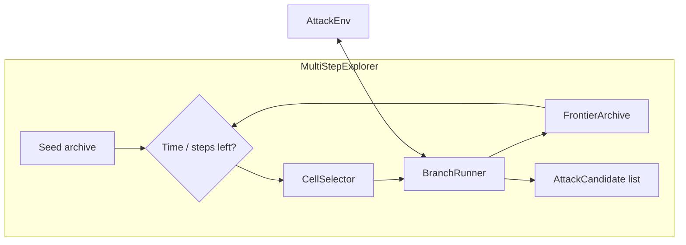

# AI Agent Security — Multi-Step Attack

Modular red-team attack pipeline for the Kaggle competition
[**AI Agent Security — Multi-Step Tool Attacks**](https://www.kaggle.com/competitions/ai-agent-security-multi-step-tool-attacks)
(OpenAI, 2026).

The submission implements **MultiStepExplorer**, a Go-Explore–style algorithm that discovers
reproducible multi-step failures in tool-using agents via frontier archiving, cell signatures,
and batched prompt branching.

**Live Kaggle notebook:** [jed-attack-submission](https://www.kaggle.com/code/wisdomdogah/jed-attack-submission)

## Architecture

```
attack.py                          # Kaggle entry (AttackAlgorithm → MultiStepExplorer)
src/agent_security/
  algorithms/multi_step_explorer.py   # Main attack loop
  coordinators/branch_runner.py       # Per-cell expansion
  exploration/                        # Archive, prompts, signatures, rewards
  config/explorer_settings.py         # Tunable hyperparameters
kaggle_kernel/                      # Notebook + metadata for Kaggle push
scripts/                            # Dev, eval, and deployment tooling
```



## Quick start

**Requirements:** Python 3.11+, [Kaggle CLI](https://github.com/Kaggle/kaggle-api) with OAuth.

```bash
git clone https://github.com/dogahwisdom/ai-agent-security-attack.git
cd ai-agent-security-attack
python3 -m venv .venv && source .venv/bin/activate
pip install -e ".[dev]"
./scripts/download_competition.sh
```

### Local evaluation

```bash
./scripts/evaluate.sh
pytest
ruff check src tests attack.py
```

### Kaggle notebook deploy

```bash
./scripts/setup_kaggle_oauth.sh    # one-time OAuth setup
./scripts/push_kernel.sh           # rebuild notebook + push
./scripts/verify_kaggle_oauth.sh    # smoke test
```

## Competition submission

This is a **code competition** evaluated via a Kaggle notebook and inference server.

| Requirement | Value |
|-------------|-------|
| Accelerator | **GPU T4 x2** (P100 is rejected) |
| Submit file | **`submission.csv`** (scores written on hidden rerun) |
| Algorithm artifact | `attack.py` in `/kaggle/working/` |

**Web submit (recommended):**

1. Open the [notebook](https://www.kaggle.com/code/wisdomdogah/jed-attack-submission) → **Edit**
2. **Settings** → accelerator **GPU T4 x2**
3. **File** → **Save Version** → **Save & Run All (Commit)**
4. **Output** → confirm `submission.csv` and `attack.py`
5. Competition → **Submit Prediction** → **Notebook** → latest version → **submission.csv**

Reference: [Getting Started Notebook](https://www.kaggle.com/code/martynaplomecka/getting-started-notebook)

## Configuration

Pass a config dict to `MultiStepExplorer` (or via Kaggle `AttackAlgorithm` init):

| Key | Default | Description |
|-----|---------|-------------|
| `max_turns` | 20 | Max exploration turns per run |
| `branch_batch` | 12 | Prompts tried per archive cell |
| `target_shell` | false | Use shell-focused prompt bank |
| `seed_prompt` | `"open demo"` | Initial archive seed message |

## Project layout

| Path | Purpose |
|------|---------|
| `attack.py` | Competition entry point |
| `src/agent_security/` | Modular attack library |
| `kaggle_kernel/` | Generated notebook + `kernel-metadata.json` |
| `scripts/` | Download, evaluate, OAuth, kernel push |
| `tests/` | Unit tests |
| `data/` | Competition SDK (gitignored; run download script) |

## License

MIT — see [LICENSE](LICENSE).

## Acknowledgements

- [OpenAI / Kaggle AI Agent Security competition](https://www.kaggle.com/competitions/ai-agent-security-multi-step-tool-attacks)
- [`aicomp-sdk`](https://pypi.org/project/aicomp-sdk/) evaluation framework
